:::note[更新]
2024年7月10日
:::

最初はどうしても満足できなかったこまどアバターですが、いろいろな改変を重なって、いまはメインになりました。一部は0.8、0.6のスケールで使った時もありましたが、ここでは記録しません。

順番：購入順
  

## Table of Contents

- [ミントちゃん](#ミントちゃん)
- [ミルクちゃん](#ミルクちゃん)
    - [ひかり](#Milk-Hikari)
    - [なのはな](#Milk-Nanohana)
    - [April Fools](#Milk-What-is-this)
- [カリンちゃん](#カリンちゃん)
- [ラスクちゃん](#ラスクちゃん)
- [シフォンちゃん](#シフォンちゃん)
 

## ミントちゃん

ミントちゃんは最初に購入したこまどアバターで、ブラックフライデーセールで購入しました。

### Ver 1.0

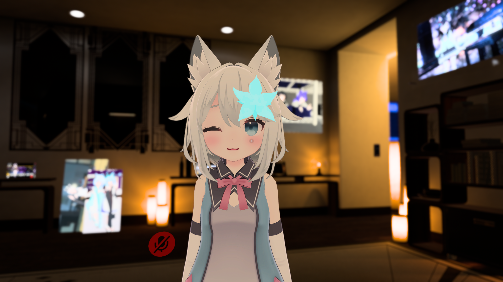

2021/11

初期改変です。ミーシェちゃんと同じ花のアクセを付けました。これで積みアバターになってしまいました。

### Ver 1.1

一時期黄色の服を着せましたが、写真が残りませんでした。

### Ver 2.0

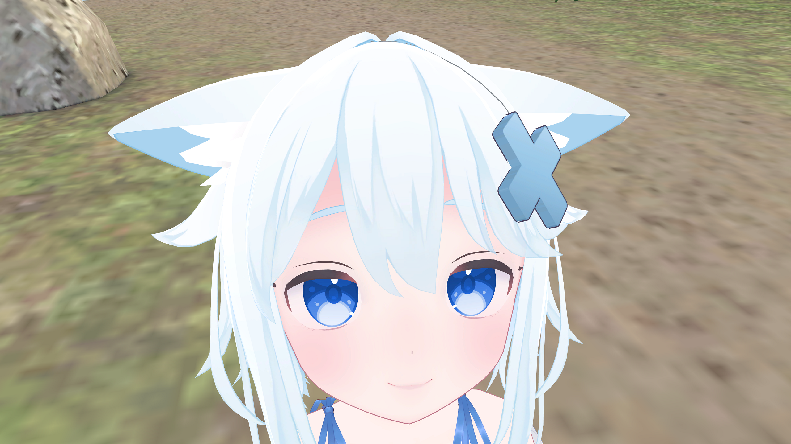

2022/07

瞳と髪の色を変えて、フリル水着を着せました。この時からすでにミルクちゃんの瞳を使うようになりました。（写真は7月でしたが、改変の期日は不明です）

### Ver 3.0

2023/01

ロリータ浴衣を着せて、ミルククラウンを付けました。瞳の色も変えました。上と同じ、改変の期日は不明ですが、これからだんだんと使うようになりました。

### Ver 4.0

2023/03

インベントリーシステムをセットアップして、和セーラーを合わせて着せました。ミルクちゃんと同じ、カリンちゃんのツインテールも付けました。ミルククラウンも外しました。これではもういまとほぼ同じになっています。

### Ver 4.1

2023/03

リボンをミルクちゃんのに変えました。Modular Avatarも対応しました。

### Ver 5.0

2023/04/16

髪の色を浅くし、ツインテールのテクスチャも変えました。

### Ver 5.1

2023/05

瞳のテクスチャをカリンちゃんのに変えました。

### Ver 5.2

2023/05

FXレイヤーを調整しました。Hikariと同じ、FXのジェスチャーレイヤーも変えました。

### Ver 5.3

2023/07/09

下着をカリンちゃんのに変えました。ライティング修正を行いました。

### Ver 5.4

2023/08

スケールシステムを消しました。ペンシステムを更新しました。ライティング修正を行いました。

### Ver 5.5

2023/10

星宮を導入しました。便利ツールをAPTにアップグレードしました。

### Ver 5.6

2023/12

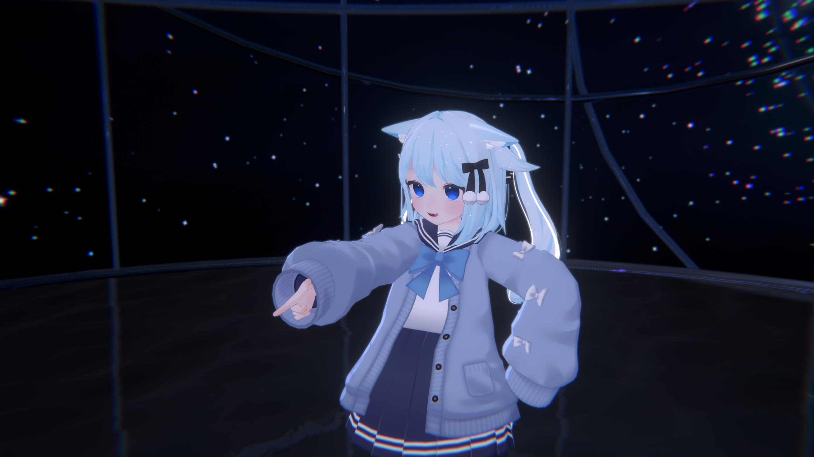

GestureレイヤーのWDを切りました。

### Ver 5.7

2023/12

ツインテールを外せるようにしました。

髪の色を少し変えました。

ほかの変更もあるかもしれませんがもう忘れました。

### Ver 5.8

2024/03

Unity 2022.3に対応しました。

### Ver 5.9

2024/05

Unity 2022.3.22に対応しました。
  

## ミルクちゃん

こまどアバターの二番目で購入したミルクちゃんは最初からメインアバターです。初めてのキメラ改変もミルクちゃんです。

### Ver 1.0

2022/06

初期改変は白と水色に改変しました。衣装はそのときに購入したフリル水着でした。アバター改変につれて、衣装が外されたことが多くありましたが、このフリル水着はまだ現役です。

### Ver 2.0

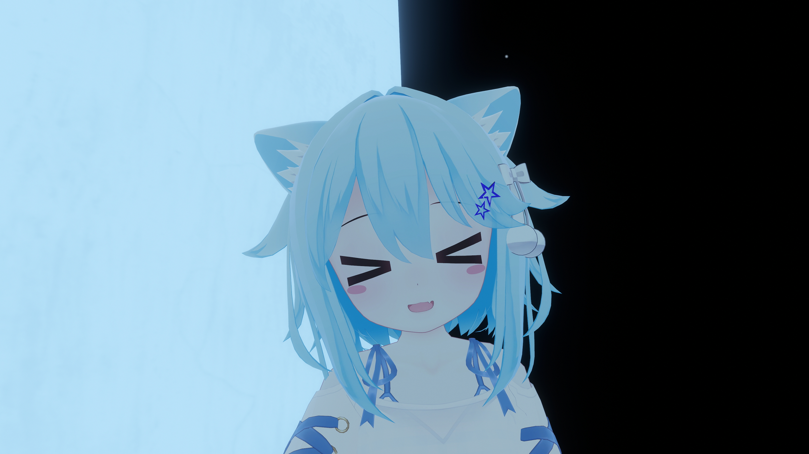

2022/07

ミルクちゃんは私の最初のキメラアバターです。試しにミントちゃんの髪を付けました。インベントリーシステムでいつでも元の髪に変えられる状態になっています。このあとの写真はミルクちゃんの髪で撮ったのと、ミントちゃんの髪で撮ったのが混在しています。両方共によく使われています。

ミーシェちゃんに使っているアクセも付けてみましたが、そのあと外しました。

### Ver 3.0

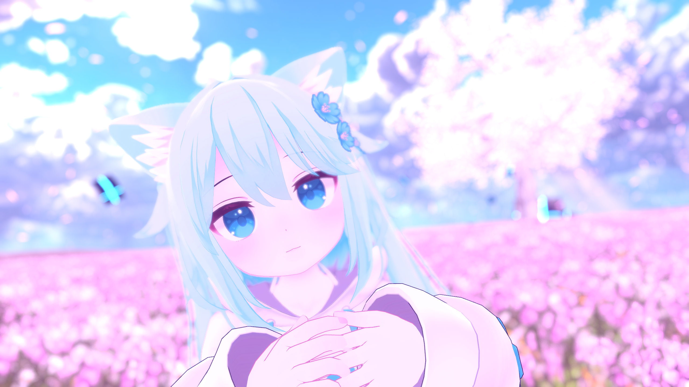

2022/09

アクセをいろいろ変えました。カリンちゃんのツインテールも付けてみましたが、そのときはテクスチャのエラーがまだ残っていました。

### Ver 3.1

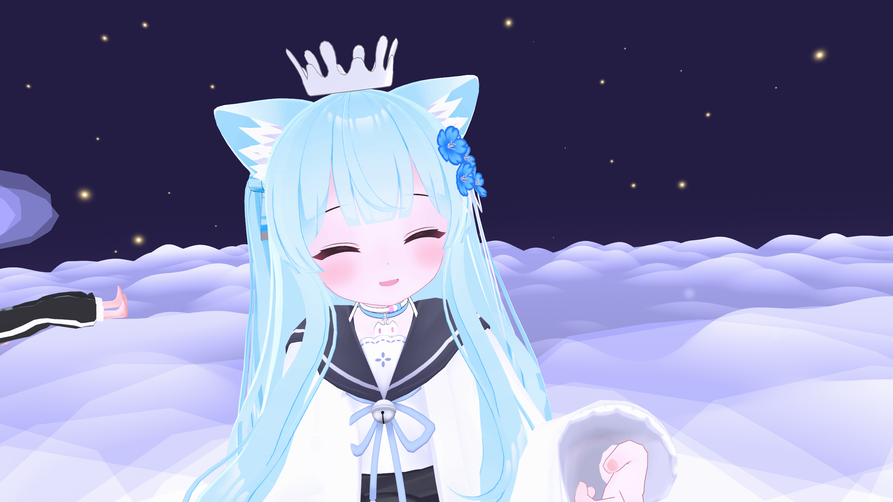

2022/09

和セーラーを着せました。アクセもいろいろ変えました。

### Ver 3.2

2022/09

リボンのテクスチャエラーを直しました。

### Ver 3.3

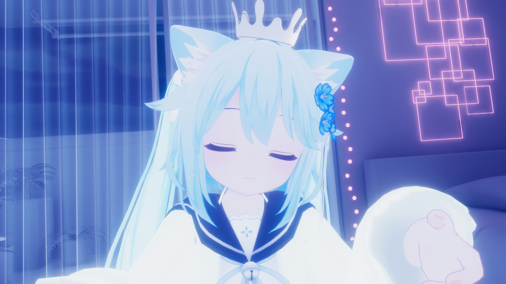

2023/02

チョーカーを外しました。瞳のテクスチャも変えましたが、写真はとれませんでした。

### Ver 3.4

2023/03

リボンを元のに戻し、りあちゃん制服を着せました。Modular Avatarも対応しました。

### Ver 4.0

2023/04/16

髪の色を浅くし、ツインテールのテクスチャも変えました。

### Ver 4.1

2023/05

瞳のテクスチャをカリンちゃんのに変えました。

### Ver 4.2

2023/05

FXレイヤーを調整しました。Hikariと同じ、FXのジェスチャーレイヤーも変えました。

### Ver 4.3

2023/08

スケールシステムを消しました。ペンシステムを更新しました。

### Ver 4.4

2023/10

アバターペンを外し、便利ツールをAPTにアップグレードしました。

### Ver 4.5

2023/12

GestureレイヤーのWDを切りました。

### Ver 4.6

2024/01

P-Storeさんから頂きました「うさにゃんこ」を着せました。

髪の色を少し変えました。瞳を白にしました。

他にもなにかしたかもしれませんがもう忘れました。

### Ver 4.7

2024/03

Unity 2022.3に対応しました。

### Ver 4.8

2024/04

瞳の色を戻しました。ライティングシステムを導入しました。光のモノクロ化を導入しました。表情システムを作成しました。

### Ver 4.9

2024.05

Unity 2022.3.22に移行しました。

### Ver 5.0

2024.05

瞳の色を変更しました。
  

## Milk-Illumina

2024/03

Milk-Illuminaはミラー、カメラで違う髪色が映るようなデザインです。なのはなちゃんと同じ髪のデザインで、衣装はReURWを着せています。（WIP）
  

## Milk-Hikari

Milk-Hikariは髪の色変えを実証するため作ったむらさきと白のミルクちゃんです。

### Ver 1.0

2023/03

フリル水着を着せています。

### Ver 1.1

2023/05

FXレイヤーの実証として初めてFXレイヤーのExitを活用しました。実証のため、FXのジェスチャーレイヤーも変えました。

### Ver 1.2

2023/08

スケールシステムを消しました。ペンシステムを更新しました。

### Ver 1.3

2023/10

アバターペンを外し、便利ツールをAPTにアップグレードしました。

### Ver 1.4

2023/12

GestureレイヤーのWDを切りました。

### Ver 2.0

2023/12

WDオフを対応し、瞳のテクスチャを変えました。（そう、これは初めての画像付きポストです）

### Ver 2.1

2024/03

Unity 2022.3に対応しました。金髪を導入しました。光のモノクロ化をオンにしました。

### Ver 2.2

2024/06

Unity 2022.3.22に対応しました。

瞳の色と表情を変更しました。モノクロ化をオフにしました。
  

## Milk-Nanohana

2024/03

なのはなちゃんは金髪のカラーバリエーションです。通常のミルクちゃん＋かりんちゃんツインテール＋フリル水着のデザインになっています。

### Ver 1.0

初期デザイン。ひかりちゃんの金髪を拡張したデザインです。

### Ver 1.1

2024/05

Unity 2022.3.22に移行しました。モノクロ化をオンにしました。

### Ver 1.2

2024.06

かりんちゃんツインテールの発光テクスチャにアニメーションを入れました。モノクロ化をオフにしました。
  

## Milk-What is this

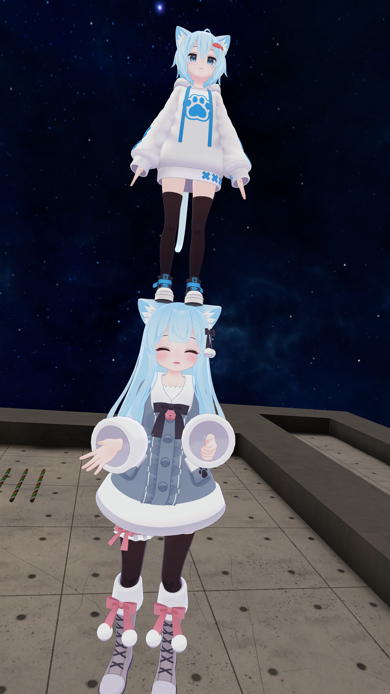

2023/04

エイプリルフールのネタとして作った、ミルクちゃんの上にラスクちゃんを載せたという少し変わった形をしています。

> 2024年エイプリルフールでは距離フェードを取り込んだアバターに換えられました。
  

## カリンちゃん

カリンちゃんはいまのメインアバターです。こまどアバターの中で唯一キメラではないアバターでもあります。

### Ver 1.0

2022/07/01

カリンちゃんは最初、髪と瞳の色を変えたシンプルな改変でした。これでもかわいいというのはカリンちゃんの強さです。

### Ver 1.1

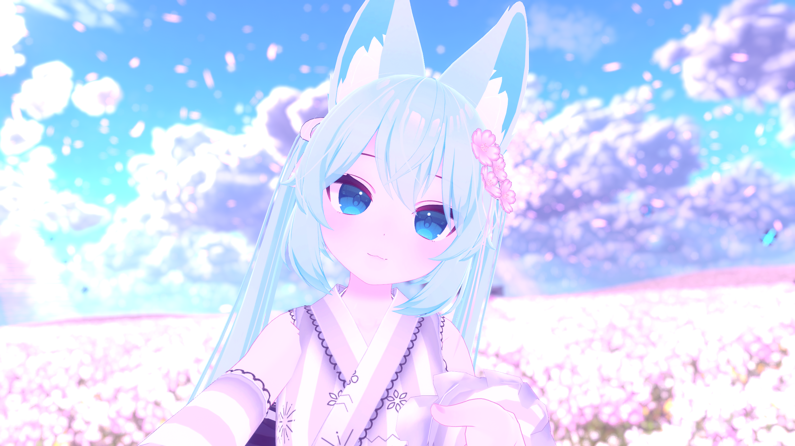

2022/09

ツインテールを伸ばして、ロリータ浴衣を着せました。

### Ver 2.0

2022/10

Valentine Hairを付けました。ミルクちゃんと同じ、インベントリーシステムでいつでも元の髪に戻せます。チョーカーも付けました。

### Ver 2.1

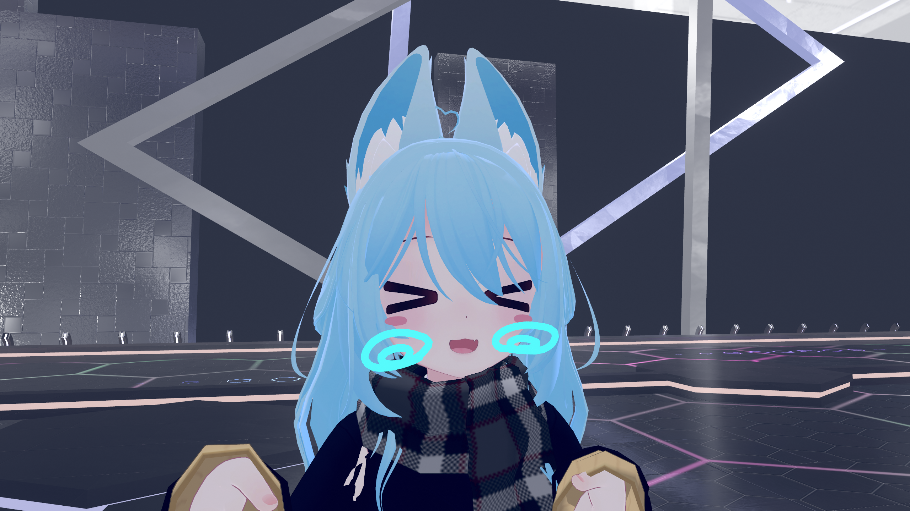

2022/12

P-Coat、和セーラーを着せました。

### Ver 3.0

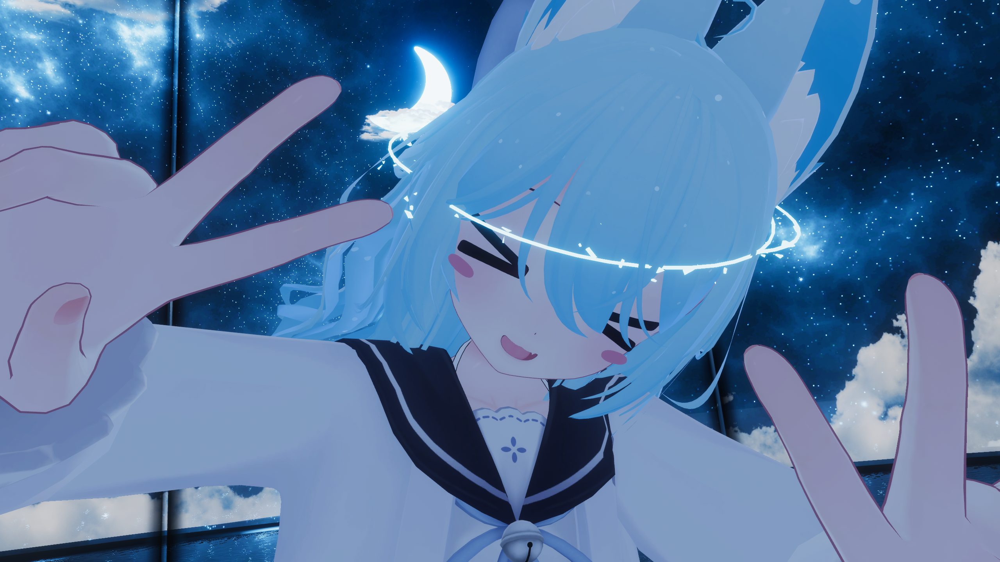

2023/01

チョーカーを外し、リングを付けました。

### Ver 3.1

2023/02

制服にゃんこを着せました。

### Ver 3.2

2023/04

りあちゃん制服を着せて、Modular Avatarも対応しました。

### Ver 4.0

2023/04/16

髪のテクスチャを変えました。

### Ver 4.1

2023/05

瞳のテクスチャを戻しました。

### Ver 4.2

2023/05

FXレイヤーを調整しました。

### Ver 4.3

2023/06/02

パーカーコーデを導入しました。

### Ver 4.4

2023/08

スケールシステムを消しました。

ペンシステムを更新しました。

### Ver 4.5

2023/10

星宮を導入しました。

アバターペンを外し、便利ツールをAPTにアップグレードしました。

### Ver 4.6

2023/12

GestureレイヤーのWDを切りました。

### Ver 4.7

2023/12

Japan Shrine Winter

瞳を白にしました。

ほかの変更もあるかもしれませんがもう忘れました。

### Ver 4.8

2024/03

Unity 2022.3に対応しました。

モノクロ化をオンにしました。新衣装を導入しました。

### Ver 4.9

2024/05

Unity 2022.3.22に対応しました。
  

## ラスクちゃん

ラスクちゃんは桔梗ちゃんと同じ、集会途中購入したアバターです。ただし、ラスクちゃんの場合は集合写真に間に合いませんでした。

### Ver 1.0

2022/08/07

最初は、髪と服の色を変えた形でした。改変は集合写真に間に合わなかったが、参加しました。

### Ver 2.0

2022/08

一時、リングとミルククラウンを付けました。

### Ver 3.0

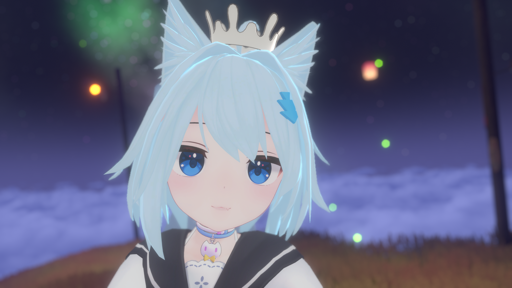

2022/12/22

ミーシェの髪、しっぽと耳を付けて、一時ミーシェとしても使われました。Any Stateの着替えレイヤーをEntryに変えました。

### Ver 3.1

2023/2/1

チョーカーを外しました。

### Ver 3.2

2023/2

髪にラメを追加しました。

スタイルが合わないため、ミルククラウンを外しました。

新しい多機能ツールを導入しました。

### Ver 3.3

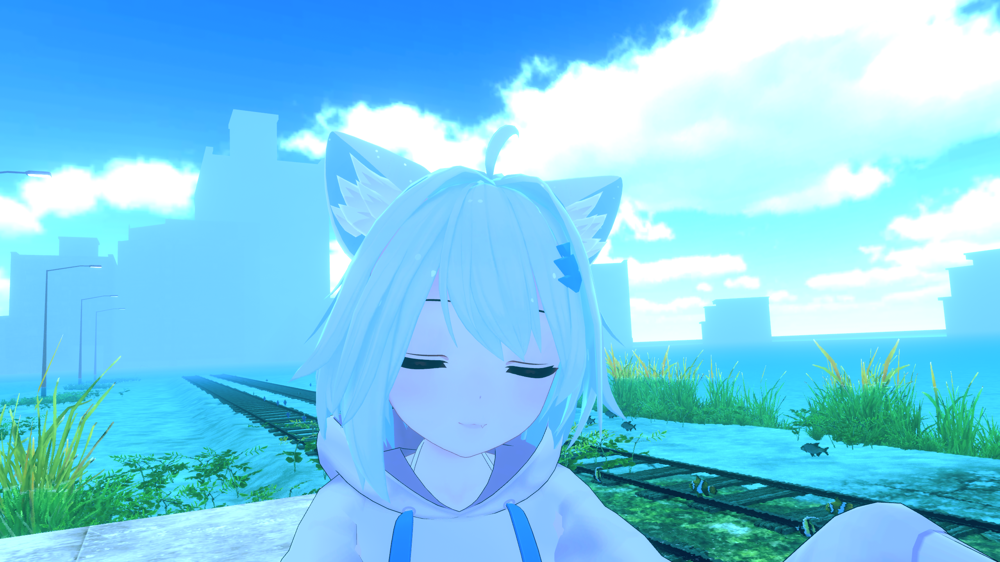

2023/2/24

髪の色を少し変えました。色が合わないなどいろいろ悩みましたが、今回はやっといい感じになりました。

### Ver 4.0

2023/04

りあちゃん制服を着せました。Module Avatarも導入しました。

### Ver 4.1

2023/05

FXレイヤーを調整しました。

### Ver 4.2

2023/08

スケールシステムを消しました。ペンシステムを更新しました。

### Ver 4.3

World: Terrors Of Nowhere - Museum Whitenight

2023/10

便利ツールをAPTにアップグレードしました。

### Ver 4.4

2023/12

GestureレイヤーのWDを切りました。

### Ver 4.5

2024/03

Unity 2022.3に対応しました。

### Ver 4.6

2024/05

Unity 2022.3.22に移行しました。
  

## シフォンちゃん

元日に改変RTAをしたシフォンちゃんは普段と違って白髪にしています。最初に着せた服はセロリです。しっぽもふもふでかわいいですね。

### Ver 1.0

2024/01/01

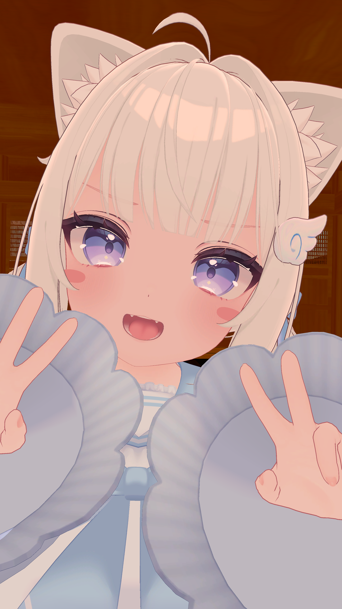

改変RTAなので事前準備いろいろしましたので、30分でこのようになりました。MMD対応も行いました。いろいろミスったのでその後修正されました。

### Ver 1.1

2024/01

顔の形の変更や各種の修正をしました。

### Ver 1.2

2024/03

Unity 2022.3に対応しました。

### Ver 1.3

2024/05

Unity 2022.3.22に移行しました。

### Ver 2.0

2024/07

髪型を変えました。アイテクスチャの色を変えました。各種衣装を導入しました。各種修正を行いました。

### Ver 2.1

2024/07

距離フェードを適用しました。