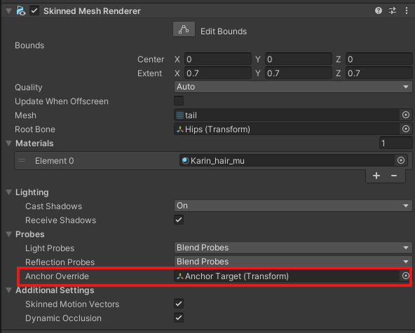
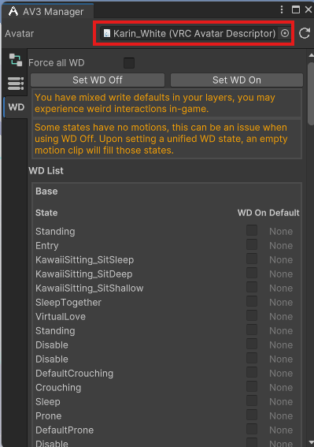
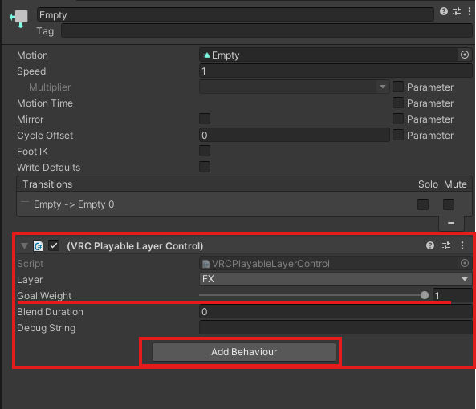

:::note[更新]
2024年7月10日
:::

## 目次
- [General](#General)
  - [レンダリング・ライティング](#レンダリング・ライティング)
  - [FX・アニメーション](#FX・アニメーション)

## General

### レンダリング・ライティング

##### **アバターの衣装の明るさが違う**

Avatar の Skinned Mesh Renderer (SMR) に Anchor Override という欄があります。

通常、アバターのオリジナルパーツではすでに何かが入っていますが、衣装ではnoneになっているときが多いです。

アバターのオリジナルパーツと同じのObject入れると完成です。

キメラアバターなども、すべてのSMRに同じAnchor Overrideが入っているように気おつけましょう。

##### **アバターが白ではないライティング環境で変な色になる**

> liltoon のみ動作します

liltoonを利用する場合、ライティング設定の中に「ライティングモノクロ化」という選択肢があります。

もしその値が0になっている場合、0.5~1に設定すると受ける影響が減ります。（通常では0.5が好ましいです）

##### **アバターがライティングが暗いときに真っ黒になる**

シェーダーによってライティング設定で明るさ下限を設定することができます。

liltoonではライティング設定で明るさ下限を0.1以上にすると、アバターのライティングが改善されます。

##### **アバターの服が一定の角度で見ると消える**

Boundsが正しく設定されていない可能性があります。Skinned Mesh Renderer (SMR)のBoundsのExtentを全部大きくする（ここでは0.7）と修正されます。

## FX・アニメーション

##### **アバターの表情がおかしくなる**

今のバージョンでは、FXレイヤーでWrite Defaultオンとオフを混ぜると発生するバグです。もしアバター本体のFXがオンであればすべてのアニメーションのWrite Defaultをオンにし、オフであれば全部オフにしたほうが良いです。ただし、デフォルトがオンの場合Write Defaultをそのまま切ると正しく動作しませんので、ガイドに従って操作してください。

ちなみにWrite Defaultsを確認するには便利なツールがあります。VCCでAvatar3Managerというツールをプロジェクトに導入し、アバターを上の欄にDrag&DropするとWrite Defaultsがオフなのか確認できます。同じAnimator Controller（例えばFX）のWrite Defaultsが全部同じにすると直ります。

> Av3Managerは他のAnimator ControllerのWrite DefaultsがFXに違っても警告が出ますがFXの中で全部同じにすれば十分です。

##### **MMDワールドで表情が出ない**

シェープキーがない場合とWrite Defaultがオフである場合、Write Defaultが混ぜている場合があります。

**シェープキーがない場合**では、Blenderで追加するか、ツールで追加するのが一般的です。
    
おすすめなツール[MMD表情設定ツール](https://booth.pm/ja/items/3696116)

> この方法はToggleに関する基礎知識が必要です

**Write Defaultがオフ**の場合では、FXレイヤーにFX_OFFのレイヤーをWeightが0のままで追加し、Defaultsの下に置きます。中に空きのアニメーション2つを入れ、そのアニメーションにVRC Playable Layer Controlを入れます。コンポーネントのLayerをFXにし、オレンジ色のアニメーション（デフォルト）でのGoal Weightを1に、もう一つを0にします。接続してToggleを作ったら、そのToggleをオンにすればMMDで表情が出るようになります。ただし、このレイヤーはFXを無効にするため、代わりにジェスチャーで表情が出なくなります。

ただし、SceneでAvatarの下の衣装が全部オンにしている場合などではカオスな状況になりますので、この方法を使う場合アップロード時では必ずMMDのときに不要なオブジェクト（**ボーンとPBを含め**）すべてオフにしてください。（MAをご利用の場合、ボーンをオンのままにしてください。
 

**Write Defaultが混ぜている場合**では、上の [アバターの表情がおかしくなる](#アバターの表情がおかしくなる) にご参照ください。